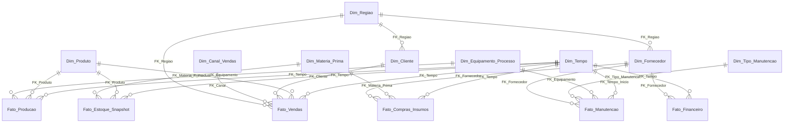

# Modelagem, Implementação e Governança de Data Warehouses

## Projeto 4: Data Warehouse em Ambiente Local - Modelagem e Implementação

Este projeto consiste na modelagem e implementação de um Data Warehouse em ambiente local utilizando Docker para a empresa fictícia **AlfaMaq Manufatura S.A.** (uma indústria de transformação de matérias-primas em produtos acabados). 

O objetivo é estruturar uma base de dados analítica otimizada para responder a questões críticas sobre desempenho de negócios, eficiência de produção, controle de qualidade, manutenção de ativos e saúde financeira.

---

# Esquema do Data Warehouse - AlfaMaq Manufatura S.A.

Este documento apresenta a especificação técnica completa e atualizada do Data Warehouse (DW), estruturado no modelo dimensional (Star Schema / Bus Architecture).

---

## 1. Diagrama de Relacionamento (Mermaid)

---

## 2. Tabelas de Dimensão (Tabelas Dim)

### Dim_Tempo
Tabela contendo os atributos temporais para análise de períodos.
*   **SK_Tempo** (INT, PK): Surrogate Key de data (formato: AAAAMMDD).
*   **Data** (DATE): Data no formato padrão.
*   **Dia** (INT): Dia do mês (1 a 31).
*   **Mes** (INT): Mês numérico (1 a 12).
*   **Ano** (INT): Ano correspondente.
*   **Flag_Fim_Semana** (BOOLEAN): Verdadeiro se for sábado ou domingo.

### Dim_Produto
Tabela que armazena os dados dos produtos acabados fabricados pela empresa.
*   **SK_Produto** (INT, PK): Surrogate Key autoincremental.
*   **NK_Produto** (VARCHAR(50)): Código de origem do produto (Natural Key).
*   **Nome_Produto** (VARCHAR(150)): Nome comercial do produto acabado.
*   **Descricao** (TEXT): Descrição técnica do produto.
*   **Categoria** (VARCHAR(100)): Grande grupo do produto (ex: 'Motores').
*   **Subcategoria** (VARCHAR(100)): Subgrupo (ex: 'Motores Elétricos Trifásicos').
*   **Unidade_Medida** (VARCHAR(20)): Unidade de comercialização (ex: 'Unidade', 'Lote').
*   **Preco_Sugerido** (NUMERIC(12,2)): Preço de tabela sugerido.
*   **Custo_Padrao** (NUMERIC(12,2)): Custo médio padrão projetado para produção.

### Dim_Materia_Prima
Insumos utilizados nos processos de fabricação.
*   **SK_Materia_Prima** (INT, PK): Surrogate Key autoincremental.
*   **NK_Materia_Prima** (VARCHAR(50)): Código de origem do insumo.
*   **Nome_Materia_Prima** (VARCHAR(150)): Nome do insumo (ex: 'Aço Carbono 1020').
*   **Descricao** (TEXT): Descrição técnica do insumo.
*   **Categoria_Insumo** (VARCHAR(100)): Tipo de material (ex: 'Metais', 'Fixadores').
*   **Unidade_Medida** (VARCHAR(20)): Unidade física (ex: 'Kg', 'Metro', 'Litragem').

### Dim_Cliente
Clientes compradores da AlfaMaq.
*   **SK_Cliente** (INT, PK): Surrogate Key autoincremental.
*   **NK_Cliente** (VARCHAR(50)): Código do cliente no sistema de origem (ERP).
*   **Nome_Cliente** (VARCHAR(150)): Nome fantasia ou razão social.
*   **CNPJ_CPF** (VARCHAR(20)): Documento de identificação fiscal.
*   **Segmento** (VARCHAR(50)): Classificação comercial (ex: 'Distribuidor', 'Parceiro Industrial').
*   **FK_Regiao** (INT, FK): Aponta para `Dim_Regiao`.

### Dim_Fornecedor
Parceiros fornecedores de matérias-primas e prestadores de serviços de manutenção.
*   **SK_Fornecedor** (INT, PK): Surrogate Key autoincremental.
*   **NK_Fornecedor** (VARCHAR(50)): Código do fornecedor no ERP.
*   **Nome_Fornecedor** (VARCHAR(150)): Razão social do fornecedor.
*   **CNPJ** (VARCHAR(20)): CNPJ do fornecedor.
*   **Score_Qualidade** (NUMERIC(4,2)): Nota histórica de qualidade atribuída ao fornecedor (0 a 10).
*   **Tipo_Produto_Fornecido** (VARCHAR(100)): Descrição do tipo de suprimento (ex: 'Chapas metálicas', 'Componentes eletrônicos').
*   **FK_Regiao** (INT, FK): Aponta para `Dim_Regiao`.

### Dim_Equipamento_Processo
Máquinas e linhas de produção física de fabricação.
*   **SK_Equipamento** (INT, PK): Surrogate Key autoincremental.
*   **NK_Equipamento** (VARCHAR(50)): Código do ativo imobilizado (patrimônio).
*   **Nome_Equipamento** (VARCHAR(150)): Nome identificador da máquina.
*   **Linha_Producao** (VARCHAR(100)): Linha física a qual pertence.
*   **Setor_Fabrica** (VARCHAR(100)): Setor onde está instalada (ex: 'Estamparia').
*   **Status_Operacional** (VARCHAR(50)): Status padrão ('Operacional', 'Aposentada').
*   **Capacidade_Nominal** (NUMERIC(12,2)): Produção teórica máxima por hora.
*   **Local_Armazenamento_Destino** (VARCHAR(150)): Armazém onde são estocados os itens produtos nesta máquina.

### Dim_Canal_Vendas
Canais por onde ocorrem os pedidos.
*   **SK_Canal** (INT, PK): Surrogate Key autoincremental.
*   **NK_Canal** (VARCHAR(50)): Código do canal.
*   **Nome_Canal** (VARCHAR(100)): Nome do canal (ex: 'E-commerce B2B', 'Venda Direta').
*   **Tipo_Canal** (VARCHAR(50)): Categoria do canal ('Físico', 'Digital', 'Representante').
*   **Regiao_Atuacao** (VARCHAR(100)): Área geográfica de cobertura do canal.
*   **Responsavel_Canal** (VARCHAR(100)): Nome do diretor/gerente do canal.

### Dim_Tipo_Manutencao
Classificações de intervenções técnicas.
*   **SK_Tipo_Manutencao** (INT, PK): Surrogate Key autoincremental.
*   **Nome_Tipo** (VARCHAR(100)): Tipo de manutenção ('Preventiva', 'Corretiva', 'Preditiva').
*   **Descricao** (TEXT): Descrição técnica do procedimento padrão.
*   **Periodicidade_Recomendada** (VARCHAR(50)): Frequência padrão sugerida (ex: 'Mensal').
*   **Nivel_Criticidade** (VARCHAR(50)): Grau de impacto no processo ('Alta', 'Média', 'Baixa').

### Dim_Regiao
Entidade que unifica dados geográficos e de localização para clientes, fornecedores e transações.
*   **SK_Regiao** (INT, PK): Surrogate Key autoincremental.
*   **Cidade** (VARCHAR(100)): Nome da cidade.
*   **Estado** (VARCHAR(50)): Estado ou unidade federativa (UF).
*   **Pais** (VARCHAR(100)): País.
*   **Macroregiao** (VARCHAR(100)): Região geográfica macro (ex: 'Região Sudeste', 'Norte').

---

## 3. Tabelas Fato (Tabelas Fact)

### Fato_Producao
Mapeia o andamento diário da fabricação industrial.
*   **FK_Tempo** (INT, FK): Data de realização do lote de produção.
*   **FK_Produto** (INT, FK): Produto acabado gerado.
*   **FK_Equipamento** (INT, FK): Máquina utilizada no processo.
*   **Quantidade_Produzida** (INT): Total de itens fabricados.
*   **Quantidade_Aprovada** (INT): Total de itens aprovados no controle de qualidade.
*   **Quantidade_Defeituosa** (INT): Total de itens descartados ou retrabalhados por defeito.
*   **Tempo_Producao_Minutos** (NUMERIC(10,2)): Tempo operacional total decorrido.
*   **Tempo_Inatividade_Minutos** (NUMERIC(10,2)): Minutos em que a máquina esteve parada por problemas operacionais.
*   **Custo_Producao_Total** (NUMERIC(12,2)): Custo contábil do lote fabricado.

### Fato_Vendas
Armazena dados transacionais das vendas.
*   **FK_Tempo** (INT, FK): Data do faturamento do pedido.
*   **FK_Cliente** (INT, FK): Cliente comprador.
*   **FK_Produto** (INT, FK): Produto adquirido.
*   **FK_Canal** (INT, FK): Canal de vendas que gerou a negociação.
*   **FK_Regiao** (INT, FK): Local de entrega/faturamento físico da venda.
*   **Quantidade_Vendida** (INT): Volume de itens comercializados.
*   **Preco_Unitario** (NUMERIC(12,2)): Preço praticado na venda.
*   **Valor_Venda_Bruto** (NUMERIC(12,2)): Subtotal bruto (Quantidade * Preço).
*   **Valor_Desconto** (NUMERIC(12,2)): Valor de desconto aplicado à venda.
*   **Valor_Venda_Liquido** (NUMERIC(12,2)): Valor final líquido faturado.
*   **Custo_Venda_Estimado** (NUMERIC(12,2)): Custo industrial padrão dos itens vendidos (COGS).
*   **Lucro_Venda** (NUMERIC(12,2)): Lucratividade bruta da transação (Líquido - Custo).

### Fato_Compras_Insumos
Mapeia a aquisição de suprimentos de fornecedores.
*   **FK_Tempo** (INT, FK): Data do recebimento físico e nota fiscal.
*   **FK_Fornecedor** (INT, FK): Fornecedor emissor da nota.
*   **FK_Materia_Prima** (INT, FK): Matéria-prima recebida.
*   **Quantidade_Comprada** (NUMERIC(12,4)): Volume de matéria-prima entregue.
*   **Preco_Unitario_Compra** (NUMERIC(12,4)): Preço pago por unidade de medida.
*   **Valor_Total_Compra** (NUMERIC(12,2)): Valor bruto total da nota.
*   **Lead_Time_Dias** (INT): Quantidade de dias entre o pedido e o recebimento.
*   **Atraso_Dias** (INT): Dias de atraso frente ao cronograma prometido.
*   **Flag_Item_Conforme** (BOOLEAN): Status do teste de recebimento de qualidade (True para aprovado).

### Fato_Estoque_Snapshot
Armazena fotos periódicas (diária ou mensal) dos níveis de estoque de matérias-primas e produtos.
*   **FK_Tempo** (INT, FK): Data da foto (snapshot).
*   **FK_Produto** (INT, FK, NULLABLE): Produto acabado/WIP em estoque.
*   **FK_Materia_Prima** (INT, FK, NULLABLE): Matéria-prima estocada.
*   **Quantidade_Saldo** (NUMERIC(14,4)): Quantidade em inventário físico no dia.
*   **Custo_Unitario_Estoque** (NUMERIC(12,4)): Custo unitário contábil do item estocado.
*   **Valor_Saldo_Estoque** (NUMERIC(14,2)): Valor contábil em estoque (Quantidade * Custo).
*   **Tipo_Item** (VARCHAR(50)): Identificação da categoria física ('Matéria-Prima', 'Em Processo', 'Produto Acabado').
*   **Localizacao_Armazem** (VARCHAR(100)): Nome físico do pavilhão de estocagem.
*   **Dias_Sem_Movimentacao** (INT): Quantidade de dias que o lote está inativo em prateleira.

### Fato_Manutencao
Registra ocorrências e dados operacionais de manutenções mecânicas e elétricas.
*   **FK_Tempo_Inicio** (INT, FK): Data de abertura do chamado ou início da parada.
*   **FK_Equipamento** (INT, FK): Máquina ou linha produtiva que passou por intervenção.
*   **FK_Tipo_Manutencao** (INT, FK): Tipo de procedimento efetuado.
*   **FK_Fornecedor** (INT, FK, NULLABLE): Fornecedor prestador de serviço técnico externo.
*   **Numero_Ordem_Servico** (VARCHAR(50)): Identificação do registro de manutenção (O.S.).
*   **Tempo_Reparo_Horas** (NUMERIC(8,2)): Tempo operacional gasto no reparo físico (usado para MTTR).
*   **Tempo_Inatividade_Horas** (NUMERIC(8,2)): Tempo total que a máquina ficou inoperante devido à falha.
*   **Custo_Pecas_Substituidas** (NUMERIC(12,2)): Gasto com insumos de reparo.
*   **Custo_Mao_Obra** (NUMERIC(12,2)): Gasto financeiro com mão de obra interna ou taxa do técnico terceirizado.
*   **Custo_Total_Manutencao** (NUMERIC(12,2)): Custo acumulado total da manutenção.
*   **Descricao_Reparo** (TEXT): Detalhamento técnico do reparo executado.

### Fato_Financeiro
Consolida movimentações macrofinanceiras do caixa para controle orçamentário.
*   **FK_Tempo** (INT, FK): Data do lançamento da transação.
*   **FK_Fornecedor** (INT, FK, NULLABLE): Fornecedor associado ao pagamento.
*   **Tipo_Lancamento** (VARCHAR(50)): Natureza do lançamento ('Receita', 'Despesa Operacional', 'Folha Pagamento').
*   **Centro_Custo** (VARCHAR(100)): Área interna responsável ('Industrial', 'Administrativo', 'TI').
*   **Valor_Transacao** (NUMERIC(14,2)): Valor líquido do lançamento (Valores positivos para entradas, negativos para saídas).