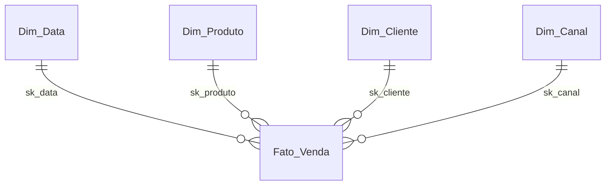

# Modelagem, Implementação e Governança de Data Warehouses

## Projeto 4: Data Warehouse em Ambiente Local - Modelagem e Implementação

Este projeto consiste na modelagem e implementação de uma infraestrutura local de Data Warehouse (DW) utilizando Docker Compose. O ambiente é composto por dois servidores PostgreSQL dedicados: um atuando como banco de dados transacional (fonte) contendo a estrutura inicial do DW, e outro atuando como área de staging (destino), preparando a arquitetura para futuras integrações de movimentação e transformação de dados via Airbyte.

---

## 1. Diagrama de Relacionamento (Mermaid)

O esquema dimensional segue um modelo estrela clássico (*Star Schema*) estruturado da seguinte forma:


```mermaid
erDiagram
    Dim_Data ||--o{ Fato_Venda : "sk_data"
    Dim_Produto ||--o{ Fato_Venda : "sk_produto"
    Dim_Cliente ||--o{ Fato_Venda : "sk_cliente"
    Dim_Canal ||--o{ Fato_Venda : "sk_canal"
```

---

## 2. Tabelas de Dimensão (Tabelas Dim)

### Dim_Produto (`dw.dim_produto`)
Armazena os dados cadastrais dos produtos comercializados.
*   **sk_produto** (SERIAL, PK): Surrogate Key autoincremental do produto.
*   **id_produto** (INT): ID de negócio de origem.
*   **nome** (VARCHAR(255)): Nome do produto.
*   **categoria** (VARCHAR(255)): Grupo/categoria do produto.

### Dim_Canal (`dw.dim_canal`)
Armazena os canais de distribuição onde as transações ocorrem.
*   **sk_canal** (SERIAL, PK): Surrogate Key autoincremental do canal.
*   **id_canal** (INT): ID de negócio de origem.
*   **nome** (VARCHAR(255)): Nome do canal (ex: E-commerce, Loja Física).
*   **regiao** (VARCHAR(255)): Região de atuação comercial.

### Dim_Data (`dw.dim_data`)
Contém os atributos temporais detalhados para análises históricas.
*   **sk_data** (SERIAL, PK): Surrogate Key autoincremental de data.
*   **data_completa** (DATE): Data padrão (AAAA-MM-DD).
*   **dia** (INT): Dia numérico (1 a 31).
*   **mes** (INT): Mês numérico (1 a 12).
*   **ano** (INT): Ano correspondente.

### Dim_Cliente (`dw.dim_cliente`)
Armazena as informações cadastrais e geográficas dos clientes.
*   **sk_cliente** (SERIAL, PK): Surrogate Key autoincremental do cliente.
*   **id_cliente** (INT): ID de negócio de origem.
*   **nome** (VARCHAR(255)): Nome completo ou razão social.
*   **tipo** (VARCHAR(255)): Segmentação do cliente (Corporativo, Individual).
*   **cidade** (VARCHAR(255)): Cidade do cliente.
*   **estado** (VARCHAR(50)): Estado/UF correspondente.
*   **pais** (VARCHAR(255)): País de residência/sede.

---

## 3. Tabela Fato (Tabela Fact)

### Fato_Venda (`dw.fato_venda`)
Consolida os fatos e as métricas numéricas das transações de vendas.
*   **sk_produto** (INT, PK/FK): Aponta para `dw.dim_produto`.
*   **sk_cliente** (INT, PK/FK): Aponta para `dw.dim_cliente`.
*   **sk_canal** (INT, PK/FK): Aponta para `dw.dim_canal`.
*   **sk_data** (INT, PK/FK): Aponta para `dw.dim_data`.
*   **quantidade** (INT): Quantidade de itens vendidos.
*   **valor_venda** (DECIMAL(10,2)): Valor líquido faturado na venda.

---

## 4. Instruções de Execução do Ambiente

A infraestrutura é configurada e executada localmente via Docker Compose.

### Como Iniciar o Ambiente
Certifique-se de ter o Docker instalado e execute na pasta raiz do projeto:
```bash
docker compose up -d
```

### Detalhes de Acesso aos Bancos de Dados
*   **Banco de Origem/Fonte** (`alfamaq_postgres_fonte`):
    *   **Porta Host:** `5432`
    *   **Database:** `alfamaq_dw`
    *   **User / Password:** `alfamaq_admin` / `alfamaq_pass`
    *   *Nota:* Este banco é inicializado automaticamente com as tabelas do DW geradas pelo script físico de tabelas.
*   **Banco de Destino/Staging** (`alfamaq_postgres_destino`):
    *   **Porta Host:** `5433`
    *   **Database:** `alfamaq_staging`
    *   **User / Password:** `alfamaq_admin` / `alfamaq_pass`