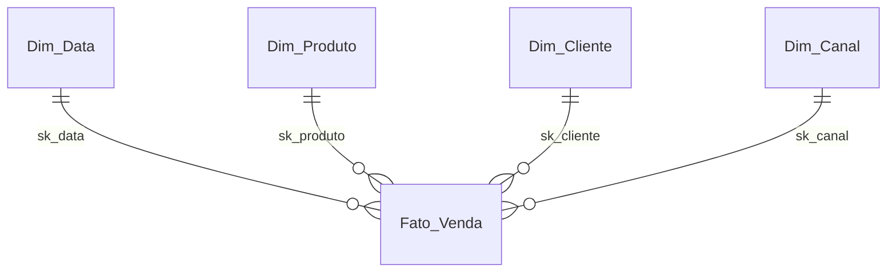

# Esquema do Data Warehouse - Modelo Dimensional

Este documento apresenta a especificação técnica completa e atualizada do Data Warehouse (DW), estruturado no modelo dimensional (Star Schema), conforme definido no script físico [02-modelo-fisico-projeto1.sql](GitHub/Projeto-4-DW-em-Amb-Local-Modelagem-e-Implement/Projeto4/02-modelo-fisico-projeto1.sql).

---

## 1. Diagrama de Relacionamento (Mermaid)

---

## 2. Tabelas de Dimensão (Tabelas Dim)

### Dim_Produto (`dw.dim_produto`)
Armazena as informações cadastrais dos produtos comercializados.
*   **sk_produto** (SERIAL, PK): Chave substituta (*Surrogate Key*) incremental e identificador único da dimensão.
*   **id_produto** (INT): ID de negócio/origem do produto.
*   **nome** (VARCHAR(255)): Nome descritivo do produto.
*   **categoria** (VARCHAR(255)): Categoria comercial do produto.

### Dim_Canal (`dw.dim_canal`)
Armazena os canais de venda utilizados para a realização das transações.
*   **sk_canal** (SERIAL, PK): Chave substituta (*Surrogate Key*) incremental e identificador único da dimensão.
*   **id_canal** (INT): ID de negócio/origem do canal de venda.
*   **nome** (VARCHAR(255)): Nome do canal (ex: E-commerce, Loja Física).
*   **regiao** (VARCHAR(255)): Região geográfica de atuação do canal.

### Dim_Data (`dw.dim_data`)
Dimensão de tempo utilizada para permitir análises temporais de tendências e períodos.
*   **sk_data** (SERIAL, PK): Chave substituta (*Surrogate Key*) incremental e identificador único da dimensão.
*   **data_completa** (DATE): Data em formato completo padrão (AAAA-MM-DD).
*   **dia** (INT): Dia numérico do mês (1 a 31).
*   **mes** (INT): Mês numérico do ano (1 a 12).
*   **ano** (INT): Ano correspondente (ex: 2024).

### Dim_Cliente (`dw.dim_cliente`)
Armazena os dados cadastrais e geográficos dos clientes.
*   **sk_cliente** (SERIAL, PK): Chave substituta (*Surrogate Key*) incremental e identificador único da dimensão.
*   **id_cliente** (INT): ID de negócio/origem do cliente.
*   **nome** (VARCHAR(255)): Nome completo ou razão social do cliente.
*   **tipo** (VARCHAR(255)): Tipo de cliente (ex: Corporativo, Individual).
*   **cidade** (VARCHAR(255)): Cidade do cliente.
*   **estado** (VARCHAR(50)): Estado/UF correspondente.
*   **pais** (VARCHAR(255)): País de residência/sede.

---

## 3. Tabela Fato (Tabela Fact)

### Fato_Venda (`dw.fato_venda`)
Consolida os fatos e métricas numéricas das transações de vendas ocorridas.
*   **sk_produto** (INT, PK/FK): Referência à chave substituta de `dw.dim_produto`.
*   **sk_cliente** (INT, PK/FK): Referência à chave substituta de `dw.dim_cliente`.
*   **sk_canal** (INT, PK/FK): Referência à chave substituta de `dw.dim_canal`.
*   **sk_data** (INT, PK/FK): Referência à chave substituta de `dw.dim_data`.
*   **quantidade** (INT): Quantidade física de produtos vendidos no item da transação.
*   **valor_venda** (DECIMAL(10,2)): Valor monetário total faturado para a respectiva venda.
